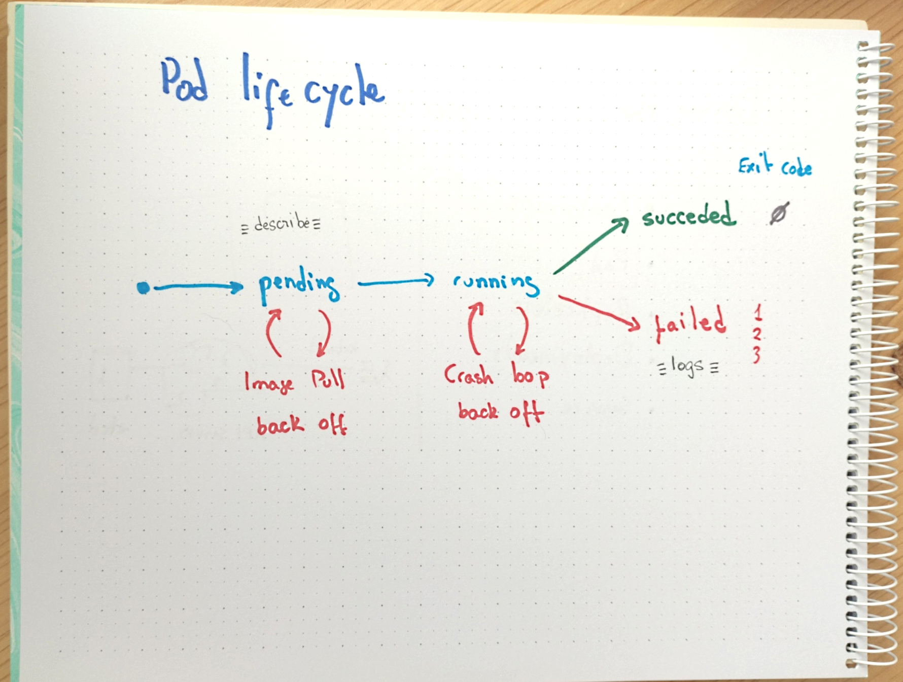

# Pod lifecycle



## Preparation

* Create the `namespace` and set it as the preferred one

```bash
kubectl create ns demo-$USER
kubectl config set-context --namespace demo-$USER --current
```

## Pod phases (status field)

* `Pending`: being scheduled or downloading image
* `Running`: at least one container is up
* `Suceeded`: `restartPolicy` was set to `never` or `onFailure`and all the containers have finished with a 0 code
* `Failed`: `restartPolicy` was set to `never` and at least one container existed with an error
* `CrashLoopBackOff`: repeated failure of at least one container is holding back pod recreation
* `ImagePullBackOff`: repeated failire to retrieve the specified image
* `Unknown`: something happened, smile
* `Completed`: A job has finished, with all of its pods succeeding

## Shutdown sequence

* The `pod` is set in `Terminating` state
* `preStop` hook execute
* `SIGTERM` sent to the process with pid `1` (use [dumb-init](https://github.com/Yelp/dumb-init) or similar)
* Remove the `pod` IP from all `endpoints`
* Kubernetes waits `spec.terminationGracePeriodSeconds` (30s by default)
* `SIGKILL` sent to proces with pid `1`

## Pod resiliency

* The pod `restartPolicy` is only applied at node level
* To survive node failure a controller (`job`, `resplicaset`, `deployment`...) should be used

## Playing with pod status

* Run this poor pod and check how it goes from *ContainerCreating* to *Running* to *Error*

```bash
kubectl run run-once-and-fail \
  --image bash \
  --restart=Never \
  -- bash -c "exit 1"

kubectl get pod run-once-and-fail -owide
```

* Check the resulting status of the pod (`Error`)

```bash
kubectl describe pod run-once-and-fail
```

<details>
<summary>
How can you know if the pod has been finished with a `Succeed` or a `Failed` exit?
</summary>

```bash
kubectl get pod run-once-and-fail -o json | jq .status.containerStatuses[].state
```
</details>

* Remove the namespace

```bash
kubectl delete ns demo-$USER
```


## Extraball

<details>
<summary>
How can you transform an imperative command to a declarative manifest using `--dry-run`?
</summary>

```bash
kubectl run example-of-pod \
  --image=busybox \
  --restart=Never \
  -n demo-$USER \
  --dry-run=client \
  -oyaml \
  -- sh -c "exit 1" 
```
</details>
