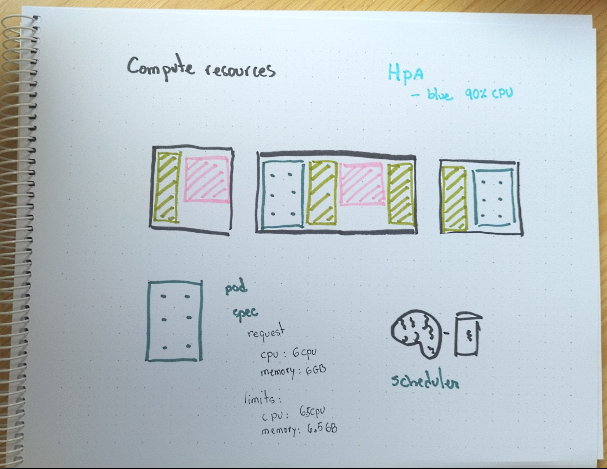

# Limits and monitoring



## Resource limits explanation

* Both memory and cpu usage can be limited
* From v1.8 ephemeral storage performance is also considered a compute resource
* Custom compute resources can be created using [extended resources](https://kubernetes.io/docs/concepts/configuration/manage-compute-resources-container/#cluster-level-extended-resources)
* The restrictions are per container: the pod limits are the sum of all its containers
* CPU usage is measured in *milicores*: 1000m is equivalent to a whole cpu
* In most situation it is better to run two replicas with one core than one pod with two cores
* A container will not be able to use more cycles per second that those provided by its quota: if it happens Kubernetes will throttle it
* A container trying to allocate more ram that specified in the quota might be restarted
* If there are no nodes with enough resources the pod will not be scheduled
* The **requests** is the minimum amount of resources the container needs
* The **limit** is the maximum amount of the resource provided by the node and can be throttled if needed


## Preparation

* Create the `namespace` and set it as the preferred one

```bash
kubectl create ns demo-$USER
kubectl config set-context --namespace demo-$USER --current
```

## Request and Limit


* Take the next manifest as the base for learning about requests and limits

```yaml
cat << EOF > stress.yaml
apiVersion: v1
kind: Pod
metadata:
  name: stress-demo
spec:
  containers:
  - name: stress-demo-container
    image: containerstack/alpine-stress
    command: ['sh', '-c', 'echo I can be stressed! && sleep 36000']
EOF
```

## Applying resource constraints

How would you modify the manifest to specify resource limits? Our application usually
needs 100MB of RAM, with spikes up to 200MB.

```yaml
cat << EOF > stress.yaml
apiVersion: v1
kind: Pod
metadata:
  name: stress-demo
spec:
  containers:
  - name: stress-demo-container
    image: containerstack/alpine-stress
    command: ['sh', '-c', 'echo I can be stressed! && sleep 36000']
    resources:
      ▒▒▒▒▒▒:
        ▒▒▒▒▒▒: "200Mi"
      ▒▒▒▒▒▒▒▒:
        ▒▒▒▒▒▒: "100Mi"
EOF
```

* Deploy de demo

```
kubectl apply -f stress.yaml
```

* Jump into the `pod` and try to allocate 500MB of memory. It will fail (but gracefully):

```bash
kubectl exec -it stress-demo -- stress --vm 1 --vm-bytes 500M --vm-hang 60 -t 60 -v
```

* Now do the same with 100MB (yes, it will succeed):

```bash
kubectl exec -it stress-demo -- stress --vm 1 --vm-bytes 100M --vm-hang 60 -t 60 -v
```

## Cleanup

* Delete all the resources

```bash
kubectl delete ns demo-$USER
```
