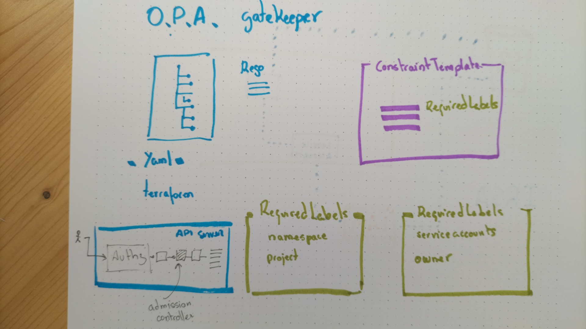

# OPA Gatekeeper



[OPA Gatekeeper](https://github.com/open-policy-agent/gatekeeper) implements and [Admission Controller](https://kubernetes.io/docs/reference/access-authn-authz/admission-controllers/) that checks the **specification** of
a resource against a set of defined rules to see if it is compliant with the requirements of the
cluster, rejecting its creation if it is not.

## Install OPA admission controller

* Install the product

```bash
kubectl apply \
  -f https://raw.githubusercontent.com/open-policy-agent/gatekeeper/release-3.7/deploy/gatekeeper.yaml
```

* Check everything is all right

```bash
kubectl get all -n gatekeeper-system
```

* Take a look at the logs generated by the `audit` pod

```bash
kubectl logs -l gatekeeper.sh/operation=audit -n gatekeeper-system
```

## Constraint template definition

A template contains the code for evaluating a restriction, written in [Rego](https://www.openpolicyagent.org/docs/latest/policy-language/). The `ConstraintTemplate` can be latter applied to different resources, like `namespaces` or `pods`.

* Create the template to enforce labels

```yaml
cat << 'EOF' > opa-template.yaml
apiVersion: templates.gatekeeper.sh/v1beta1
kind: ConstraintTemplate
metadata:
  name: requiredlabelsoparule
spec:
  crd:
    spec:
      names:
        kind: RequiredLabelsOPARule
      validation:
        # Schema for the `parameters` field
        openAPIV3Schema:
          properties:
            labels:
              type: array
              items: string
  targets:
    - target: admission.k8s.gatekeeper.sh
      rego: |
        package requiredlabelsoparule

        violation[{"msg": msg, "details": {"missing_labels": missing}}] {
          provided := {label | input.review.object.metadata.labels[label]}
          required := {label | label := input.parameters.labels[_]}
          missing := required - provided
          count(missing) > 0
          msg := sprintf("you must provide labels: %v", [missing])
        }
EOF
```

* Apply the manifest

```bash
kubectl apply -f opa-template.yaml
```

* Check for the resource creation (it is a [Custom Resource Definition](https://kubernetes.io/docs/concepts/extend-kubernetes/api-extension/custom-resources/)), so it will not appear with a `kubectl get all` command)

```bash
kubectl get ConstraintTemplate
kubectl api-resources | grep RequiredLabels
```

* The resource also appears in the `gatekeepr-system` namespace, as it is not a namespaced resource

```bash
kubectl get ConstraintTemplate -n gatekeeper-system
```

## Constraints application

Once the `ConstraintTemplate` is created, it can be used for examining any kind of resource. The link between the template and the resource is what we call a `Constraint` and and dynamically created as a `CDR` of the kind defined in the `.spec.crd` section of the template (`K8sRequiredLabels` in this example).

* Assign the `constraint` to any resource of kind `namespace` by defining this manifest, setting the name of the required label to `project`

```yaml
cat << EOF > opa-constraint.yaml
apiVersion: constraints.gatekeeper.sh/v1beta1
kind: RequiredLabelsOPARule
metadata:
  name: opa-mandatory-ns-labels
spec:
  match:
    kinds:
      - apiGroups: [""]
        kinds: ["Namespace"]
  parameters:
    labels: ["project"]
EOF
```

* Apply it

```bash
kubectl apply -f opa-constraint.yaml
```

## Check the new behavior

* Try to create a `namespace` without properly defining the `project` label (it will fail)

```bash
kubectl create ns $USER-opa-secondary-ns
```

* Be a good citizen and create a manifest to correctly deploy the `namespace`

```yaml
cat << EOF > secondary-ns.yaml
apiVersion: v1
kind: Namespace
metadata:
  creationTimestamp: null
  name: $USER-opa-secondary-ns
  labels:
    project: $USER
EOF
```

* Apply the new resource (it will succeed)

```bash
kubectl apply -f secondary-ns.yaml
```

## Additional resources

* See the [official library](https://open-policy-agent.github.io/gatekeeper-library/website/) to get a list of ready-to-use templates.
* Additional contrainst can be found in the [Anthos documentation](https://cloud.google.com/anthos-config-management/docs/latest/reference/constraint-template-library)
* Visit the [rego playground](https://play.openpolicyagent.org/) to experiment with policies, including K8s-oriented ones.


## Cleanup

* Delete the resource generated by OPA
  
```bash
kubectl delete -f https://raw.githubusercontent.com/open-policy-agent/gatekeeper/release-3.7/deploy/gatekeeper.yaml
```

