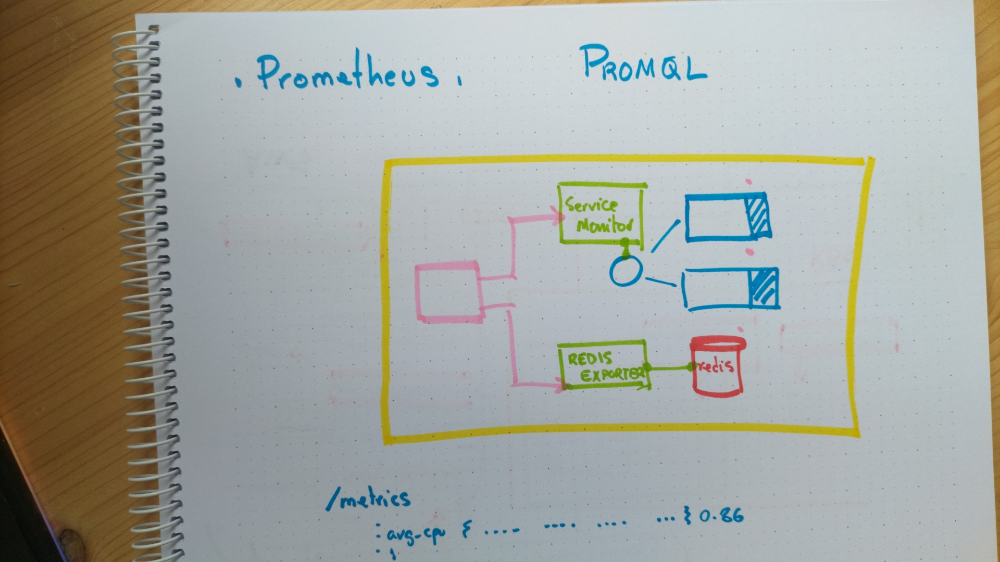

# Advanced monitoring

## Prometheus components

* Most popular solution to gather metrics from Kubernetes
* Started by SoundCloud as an internal tool
* **Not** designed for log aggregation or tracing
* *Prometheus server* stores the metrics in a time-based database
* *Rules* can be created to group those metrics
* Some of those *Rules* can define *Alerts*
* *Alert manager* extracts those rules results and sends notifications
* Provides a query language to search metrics named *Promql*
* [Prometheus operator](https://github.com/prometheus-operator/prometheus-operator) provides an easy way to deploy those components, plus *Grafana*




## Ingestion architecture

* Prometheus metrics are published through an *http* endpoint
* *Prometheus server* poll those endpoints directly or through *ServiceMonitors* and *PodMonitors*
* If the application doesn't use *http*, the usual pattern is to add an *exporter*
* A typical record looks like this: 
 
```json
http_request_total{code="200",path="/status"} 2532`
```

## Preparation

* Create the `namespace` and set it as the preferred one

```bash
kubectl create ns demo-$USER
kubectl config set-context --namespace demo-$USER --current
```

## Deploying

* Use the `helm` chart to deploy prometheus in your `namespace`

```bash
helm repo add prometheus-community https://prometheus-community.github.io/helm-charts
helm repo update
helm install mon-$USER prometheus-community/kube-prometheus-stack
```

* Check the list of resources, including `deployments` and `statefulsets`

```bash
kubectl get all
```

* Pay special attention to the configuration resources

```bash
kubectl get configmap
kubectl get secrets
```

* See there are already several `servicemonitor` defined

```bash
kubectl get servicemonitor
```

* Explore the logs of some of the components, for example the `node-exporters`

```bash
EXPORTER=$(kubectl get pod \
  -l app=prometheus-node-exporter \
  -o jsonpath={.items[0].metadata.name}\
)
echo Showing $EXPORTER logs.
kubectl logs $EXPORTER
```

## Publishing metrics from applications

* Create the resources of an example applications

```yaml
cat << EOF > example.yaml
apiVersion: apps/v1
kind: Deployment
metadata:
  name: example-app
spec:
  replicas: 3
  selector:
    matchLabels:
      app: example-app
  template:
    metadata:
      labels:
        app: example-app
    spec:
      containers:
      - name: example-app
        image: fabxc/instrumented_app
        ports:
        - name: web
          containerPort: 8080
---
kind: Service
apiVersion: v1
metadata:
  name: example-app
  labels:
    app: example-app
spec:
  selector:
    app: example-app
  ports:
  - name: web
    port: 8080
EOF
```

* Apply it

```bash
kubectl apply -f example.yaml
```

* Check what labels are needed to include a `servicemonitor` in the polling mechanism of *Prometheus server*, examining one of the existing resources

```bash
kubectl get prometheuses.monitoring.coreos.com \
  -o jsonpath={.items..spec.serviceMonitorSelector.matchLabels}; echo
```

* Get the name of one of one of the `pods` deployed with the application

```bash
APP=$(kubectl get pod \
  -l app=example-app \
  -o jsonpath={.items[0].metadata.name})
echo Your application pod is $APP.
```

* Send an *http* request to the `/metrics` endpoint of the application

```bash
kubectl exec $APP -it -- curl http://127.0.0.1:8080/metrics
```

* Focus in a particular metric, for example `process_open_fds`

```bash
kubectl exec $APP -it -- curl http://127.0.0.1:8080/metrics | grep process_open_fds
```

* Define a new `servicemonitor` for the application you just deployed

```yaml
cat << EOF > monitor.yaml
apiVersion: monitoring.coreos.com/v1
kind: Service▒▒▒▒▒▒▒
metadata:
  name: example-app
  labels:
    team: frontend
    release: mon-$USER
spec:
  selector:
    matchLabels:
      app: example-app
  endpoints:
  - port: web
EOF
```

* Create it

```bash
kubectl apply -f monitor.yaml
```

## Prometheus UI

* Get the name of the *Prometheus server* `pod`

```bash
kubectl get statefulset 

PROMETHEUS=$(kubectl get pod \
  -l app.kubernetes.io/name=prometheus \
  -o jsonpath={.items..metadata.name})
echo Your Prometheus pod is $PROMETHEUS.
```

* Stablish a tunnel to it

```bash
PROMETHEUS_PORT=$(( ( RANDOM % 1000 )  + 8000 ))
echo Your Prometheus server port is $PROMETHEUS_PORT.
kubectl port-forward $PROMETHEUS $PROMETHEUS_PORT:9090 --address='0.0.0.0' &
PROMETHEUS_TUNNEL_PID=$!
```

* Point your browser to the user interface and explore it. For example, use the query box to retrieve metrics published by your application (`process_open_fds{job="example-app"}`)

## Alert Manager UI

* Get the name of the *Alert manager* `pod`

```bash
kubectl get statefulset 

ALERT_MANAGER=$(kubectl get pod \
  -l app.kubernetes.io/name=alertmanager \
  -o jsonpath={.items..metadata.name})
echo Your Alert Manager pod is $ALERT_MANAGER.
```

* Stablish a tunnel to it

```bash
ALERT_MANAGER_PORT=$(( ( RANDOM % 1000 )  + 8000 ))
echo Your Alert Manager port is $ALERT_MANAGER_PORT.
kubectl port-forward $ALERT_MANAGER $ALERT_MANAGER_PORT:9093 --address='0.0.0.0' &
ALERT_MANAGER_TUNNEL_PID=$!
```

* Again, point your browser to your *Alert Manager* and take some time to get familiar with the different resources


## Grafana

* Get the name of the *Grafana* `pod`

```bash
kubectl get deployments

GRAFANA=$(kubectl get pod \
  -l app.kubernetes.io/name=grafana \
  -o jsonpath={.items..metadata.name}\
)
echo Your Grafana pod is $GRAFANA.
```

* Stablish a tunnel to it

```bash
GRAFANA_PORT=$(( ( RANDOM % 1000 )  + 8000 ))
echo Your Alert Manager port is $GRAFANA_PORT.
kubectl port-forward $GRAFANA $GRAFANA_PORT:3000 --address='0.0.0.0' &
GRAFANA_TUNNEL_PID=$!
```

* Decode the **default** username and password

```bash
kubectl describe secret mon-$USER-grafana

USERNAME=$(kubectl get secret mon-$USER-grafana -o jsonpath="{.data.admin-user}" \
 | base64 --decode)
echo Grafana username is $USERNAME.

PASSWORD=$(kubectl get secret mon-$USER-grafana -o jsonpath="{.data.admin-password}" \
 | base64 --decode);
echo Grafana password is $PASSWORD.
```

* Open the *Grafana* URL in your browser and introduce the username and password

* Click on the `General/Home` dashboard link

* Select the `Kubernetes / Compute Resources / Cluster` dashboard

* Wait until the trainer launches several pods, and see how the CPU utilization goes up

<details>
<summary>This piece of code will stress the cluster. Don't use it unless you know what you are doing.
</summary>

```bash
for i in {1..5}
do   
  kubectl run  --image progrium/stress stress-$RANDOM --image-pull-policy IfNotPresent --restart Never --  -t 180 -c 1
  sleep 30
done
```
</details>

# Cleanup

* Remove the tunnels

```bash
kill -9 $GRAFANA_TUNNEL_PID
kill -9 $ALERT_MANAGER_TUNNEL_PID
kill -9 $PROMETHEUS_TUNNEL_PID
```

* Delete the release

```bash
helm uninstall mon-$USER
```

* Eliminate the rest of resources

```bash
kubectl delete ns demo-$USER
```

